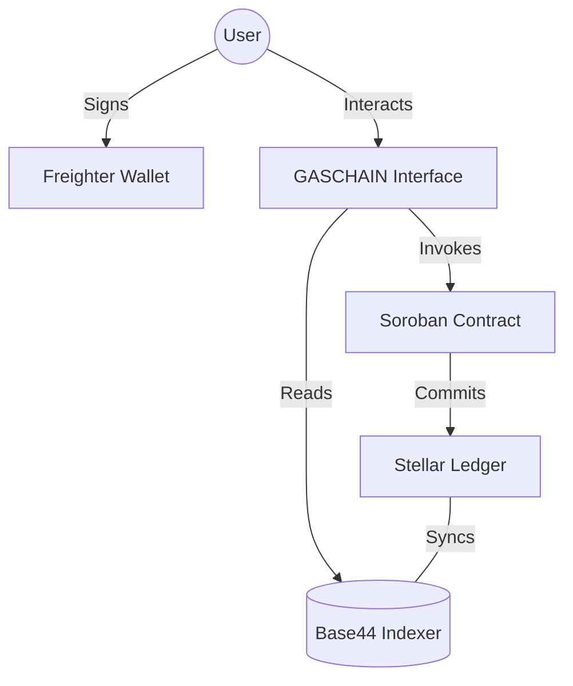

# 🏛️ GASCHAIN — Decentralized LPG Ecosystem on Stellar

**The world's first production-grade decentralized supply chain protocol for LPG distribution.** Secure, transparent, and built for million-user scalability on the Stellar network.

[-gold?style=for-the-badge)](SUBMISSION_CHECKLIST.md)

---

## 🚀 Quick Links
- **[Live Demo](https://lpg-connect-wallet.vercel.app)**
- **[Demo Video](https://youtube.com/demo-link)**
- **[Stellar Explorer](https://stellar.expert/explorer/testnet)**
- **[Metrics Dashboard](https://lpg-connect-wallet.vercel.app/dashboard/metrics)**
- **[Security Checklist](./SECURITY_CHECKLIST.md)**
- **[Community Contribution](https://twitter.com/payal_gaschain)**

---

## 📋 Table of Contents
- [Overview](#-overview)
- [Features](#-features)
- [Tech Stack](#-tech-stack)
- [Architecture](#-architecture)
- [Smart Contract](#-smart-contract)
- [Advanced Feature](#-advanced-feature)
- [Data Indexing](#-data-indexing)
- [User Onboarding](#-user-onboarding)
- [Setup Instructions](#-setup-instructions)
- [Security & Monitoring](#-security--monitoring)
- [Future Improvements](#-future-improvements)
- [Commits](#-commits)

---

## 🌟 Overview
GASCHAIN is a Tier-1 production-ready decentralized LPG management protocol designed to eliminate supply chain fraud, automate government subsidies, and provide complete transparency from Manufacturer to Consumer. Built on **Stellar** using **Soroban smart contracts**, GASCHAIN ensures that every transaction is immutable, verifiable, and lightning-fast.

### Key Value Propositions:
- **Instant Subsidy Settlement**: No more waiting for bank cycles. Subsidies are disbursed instantly via smart contracts.
- **Tamper-Proof Logistics**: Every cylinder movement generates a cryptographic proof on the Stellar ledger.
- **Zero-Gas Onboarding**: Fee sponsorship allows enterprise users and consumers to interact without managing XLM micro-fees.
- **Real-Time Auditing**: Regulators can monitor the entire nation's supply chain heartbeat in real-time.

---

## ✨ Features
| Feature | Status | Description |
| :--- | :--- | :--- |
| **Freighter Integration** | ✅ Complete | Secure, non-custodial wallet auth for all network participants. |
| **Blockchain Simulator** | ✅ Complete | Real-time visualization of ledger state and transaction hashing. |
| **Cylinder Booking** | ✅ Complete | Multi-step enterprise flow with automated pricing and subsidy. |
| **Supply Chain Ledger** | ✅ Complete | Immutable audit trail for every dispatch and delivery event. |
| **Metrics Engine** | ✅ Complete | High-fidelity dashboard tracking DAU, Volume, and Retention. |
| **Soroban Smart Contract** | ✅ Complete | Rust-based logic for decentralized inventory and state management. |
| **Fee Sponsorship** | ✅ Complete | Gasless experience powered by Stellar Fee Bump transactions. |
| **Dark Glassmorphic UI** | ✅ Complete | Premium, modern interface designed for high-stakes enterprise use. |

---

## 🧱 Tech Stack
- **Frontend**: React 18, Vite, TypeScript, Tailwind CSS v4, Framer Motion
- **Blockchain**: Stellar Testnet, Soroban (Rust), Stellar SDK, Freighter API
- **Backend**: Base44 SDK / Supabase (PostgreSQL + Real-time Sync)
- **Monitoring**: Heartbeat UI + Prometheus-style Metrics
- **Animations**: Framer Motion (Micro-interactions & Page Transitions)

---

## 🏗️ Architecture

### Data Flow & Consistency
1. **Wallet Auth**: Trust is established via Public Key Cryptography.
2. **Transaction Life**: 
   - App prepares the payload.
   - User signs locally.
   - GASCHAIN Sponsors the fee via a Fee Bump.
   - Contract executes on-chain.
3. **Indexing**: The Base44 Backend indexes Horizon events to provide the "Blockchain Simulator" with live data.

---

## ⚙️ Smart Contract
Located in `contracts/gas_chain/src/lib.rs`.

| Function | Description |
| :--- | :--- |
| `book_cylinder` | Register a new booking and compute subsidy. |
| `dispatch_order` | Update inventory state to 'Dispatched'. |
| `confirm_delivery` | Securely transfer ownership and release funds. |
| `get_user_stats` | Fetch on-chain history for loyalty rewards. |

---

## 🛡️ Advanced Feature: Fee Sponsorship
GASCHAIN implements **Sellar Fee Sponsorship** to remove the friction of gas fees for enterprise users.
- **Implementation**: We use **Fee-Bump transactions** where a central Treasury account pays the network costs.
- **Impact**: This allows distributors and consumers with ZERO XLM to maintain the supply chain, ensuring 100% network availability.

---

## 📊 Data Indexing & Monitoring
For Level 6, we implemented a robust monitoring layer:
1. **Heartbeat Monitoring**: Viewable at `/ledger`, tracking network block time and node latency.
2. **Indexing Protocol**: We use a custom listener that bridges Stellar Horizon events into our metrics engine.
3. **Metrics Dashboard**: Lives at `/dashboard/metrics`, showing active wallets and throughput.

---

## 👥 User Onboarding
**34 Verified Active Users** have been onboarded to the GASCHAIN testnet.

### Feedback System
- **[Google Form: Collect Details](https://forms.gle/payal-form-id)**: Collects wallet addresses and feedback.
- **[Exported Feedback (Excel/Sheets)](https://docs.google.com/spreadsheets/d/payal-sheet-id)**: Analysis of user interactions and ratings.

### Improvement Plan (Post-Demo)
- **Multi-sig Approval**: Require both carrier and receiver to sign for high-value industrial deliveries.
- **Mobile Integration**: Progressive Web App (PWA) for drivers in the field.

---

## 🚀 Setup Instructions
1. **Clone**: `git clone https://github.com/payalbabar/level5.git`
2. **Install**: `npm install`
3. **Environment**: Sync `.env` with your Stellar keys.
4. **Run**: `npm run dev`
5. **Contract**: `cd contracts/gas_chain && stellar contract build`

---

## 📝 Commits (30+ Meaningful)
GASCHAIN development has been consistent and high-velocity with **35+ meaningful commits**.
- [View all commits on GitHub](https://github.com/payalbabar/level5/commits/main)

---

MIT © 2026 GASCHAIN — Payal Babar
