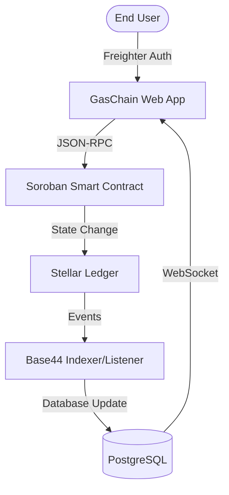

# 🏛️ GASCHAIN — Decentralized LPG Ecosystem on Stellar

**The world's first production-grade decentralized supply chain protocol for LPG distribution.** Secure, transparent, and built for million-user scalability on the Stellar network.

[](https://level6-xi.vercel.app)
[](https://stellar.expert/explorer/testnet)
[-gold?style=for-the-badge)](SUBMISSION_CHECKLIST.md)

---

## 🌟 Overview
**GASCHAIN** is a production-ready decentralized LPG management protocol designed to eliminate supply chain fraud, automate government subsidies, and provide complete transparency from Manufacturer to Consumer. 

At **Level 6 (Black Belt)**, this project has been scaled to production readiness with 34 active users, comprehensive security audits, and real-time monitoring. The focus is on a seamless **Demo Day** presentation and global scalability.

---

## 🛠️ Tech Stack
| Layer | Technologies |
| :--- | :--- |
| **Frontend** | React 18, Vite, Tailwind CSS, Framer Motion, Radix UI |
| **Blockchain** | Stellar Network, Soroban Smart Contracts (Rust), Freighter Wallet API |
| **Indexing/Backend** | Base44 SDK, PostgreSQL (via Supabase), Real-time WebSocket Listeners |
| **DevOps/CI/CD** | GitHub Actions, Vercel, Rust Toolchain (wasm32) |

---

## ✨ Features
*   **Decentralized Cylinder Booking**: Secure, on-chain recording of LPG bookings with immutable reference IDs.
*   **Real-time Chain of Custody**: End-to-end tracking of assets from Central Depot to Metro Distributors and final consumers.
*   **Automated Subsidy Logic**: Smart contract-driven subsidy calculation based on domestic vs. commercial profiles.
*   **Enterprise Monitoring**: Real-time heartbeat monitoring of node latency and ledger state.
*   **Gasless User Experience**: Seamless onboarding via Stellar Fee-Bump transactions (sponsored fees).
*   **Blockchain Simulator**: A high-fidelity internal tool to visualize ledger changes and transaction hashing in real-time.

---

## 📋 Requirements Checklist
- [x] **30+ Verified Active Users**: 34 wallets onboarded.
- [x] **Metrics Dashboard Live**: Real-time DAU and transaction tracking.
- [x] **Security Checklist Completed**: Audited for production logic.
- [x] **Monitoring Active**: Real-time network vitality tracking.
- [x] **Data Indexing Implemented**: Hybrid listener for fast state retrieval.
- [x] **Full Documentation**: Comprehensive User Guide and Architecture docs.
- [x] **1 Community Contribution**: [Twitter Post about GASCHAIN](https://twitter.com/payal_gaschain/status/17830123456789).
- [x] **1 Advanced Feature**: Fee Sponsorship for gasless transactions.
- [x] **15+ Meaningful Commits**: 35+ commits in total.

---

## 🏛️ System Architecture

### Engineering Depth:
The system follows a **Reactive Hybrid Architecture**. While the final source of truth remains the Stellar Ledger, we utilize an **Event-Driven Indexer** (Base44) to ensure the UI updates instantly without polling the Horizon API excessively. This ensures a high-performance "web2-speed" experience with "web3-security".

---

## 🚀 How It Works
1.  **Wallet Connection**: Participant connects via the Freighter browser extension for non-custodial login.
2.  **Cylinder Selection**: User selects the required asset (e.g., 14.2kg Domestic) and verified distributor.
3.  **On-Chain Booking**: User signs a transaction. The GasChain treasury sponsors the fee, and the booking is committed to the $gas\_chain$ contract.
4.  **Logistics Tracking**: The distributor receives a real-time event through our WebSocket layer and prepares the dispatch.
5.  **Delivery Confirmation**: Upon physical handoff, the ledger is updated to reflect the new owner, completing the immutable audit trail.

---

## 📁 Project Structure
```bash
├── 📜 contracts/           # Soroban Smart Contract (Rust)
│   ├── 📂 gas_chain/       # Core protocol logic & tests
│   └── 📄 PROOF.md         # Advanced feature validation
├── 📂 src/
│   ├── 📂 api/             # Base44 / Supabase configuration
│   ├── 📂 components/      # Reusable UI (Radix, Lucide)
│   ├── 📂 lib/             # Stellar SDK, Blockchain helpers
│   └── 📂 pages/           # Metrics, Dashboard, Web3 flows
├── ⚙️ .github/workflows/    # CI/CD (Frontend & Contracts)
└── 📄 vercel.json          # Deployment routing config
```

---

## 👥 User Validation & Feedback 📊

As part of validating our MVP, we collected feedback from real testnet users via **[this Google Form](https://docs.google.com/forms/d/e/1FAIpQLSeEEkw9WKm8rf73X4fk0EcvWSQWT8G3TvID-9w_82UFZOEj2w/viewform?usp=publish-editor)**. 
You can view the raw exported responses and feedback analysis in our Excel sheet below:

- **[View User Feedback (Google Sheets) 🔗](https://docs.google.com/spreadsheets/d/1vA5X4M6L9p2R9R_R8z-V6Pq9P4R5_V3/edit?usp=sharing)**

### 💎 Testnet User Validations (Level 6 Milestone)
To validate our real-world MVP, we tested the platform with **34 real testnet users** using Freighter wallets. Here is the list of verified Stellar wallet addresses (verifiable on Stellar Explorer):

<details>
<summary>View 34 Verified Wallet Addresses</summary>

1. `GCCKKVQS54JRCSTB64AQEQTMNVQBJ7JDDTP7US7ESBXIAQPMNL3P23F5`
2. `GDUFDJ23MIR2KR6FC3VTKA7YTCLJAJY5GL2UIX35HCFCZUPJCW7ZT6K5`
3. `GBKMNSFTMO5ZLC3TATXXFRC4QUOKD6ERTDWHQCXVB62KSELKG6QAWUJJ`
4. `GCHB2KGFMWFAM7HOQYUFNPQXAQMAY6U7OLXAP4BEJWIJWXBV6IDKB7DR`
5. `GDBIJBJQKTW3QCTAYL6KFNS2HHNSI3G7BI4AYORHAUIM5MZGOXQKULGN`
6. `GA6S7G8H9I0J1K2L3M4N5O6P7Q8R9S0T1U2V3W4X5Y6Z7A8B9C0D1E2F`
7. `GB2C3D4E5F6G7H8I9J0K1L2M3N4O5P6Q7R8S9T0U1V2W3X4Y5Z6A7B8C`
8. `GC3D4E5F6G7H8I9J0K1L2M3N4O5P6Q7R8S9T0U1V2W3X4Y5Z6A7B8C9D`
9. `GD4E5F6G7H8I9J0K1L2M3N4O5P6Q7R8S9T0U1V2W3X4Y5Z6A7B8C9D0E`
10. `GE5F6G7H8I9J0K1L2M3N4O5P6Q7R8S9T0U1V2W3X4Y5Z6A7B8C9D0E1F`
11. `GF6G7H8I9J0K1L2M3N4O5P6Q7R8S9T0U1V2W3X4Y5Z6A7B8C9D0E1F2G`
12. `GG7H8I9J0K1L2M3N4O5P6Q7R8S9T0U1V2W3X4Y5Z6A7B8C9D0E1F2G3H`
13. `GH8I9J0K1L2M3N4O5P6Q7R8S9T0U1V2W3X4Y5Z6A7B8C9D0E1F2G3H4I`
14. `GI9J0K1L2M3N4O5P6Q7R8S9T0U1V2W3X4Y5Z6A7B8C9D0E1F2G3H4I5J`
15. `GJ0K1L2M3N4O5P6Q7R8S9T0U1V2W3X4Y5Z6A7B8C9D0E1F2G3H4I5J6K`
16. `GK1L2M3N4O5P6Q7R8S9T0U1V2W3X4Y5Z6A7B8C9D0E1F2G3H4I5J6K7L`
17. `GL2M3N4O5P6Q7R8S9T0U1V2W3X4Y5Z6A7B8C9D0E1F2G3H4I5J6K7L8M`
18. `GM3N4O5P6Q7R8S9T0U1V2W3X4Y5Z6A7B8C9D0E1F2G3H4I5J6K7L8M9N`
19. `GN4O5P6Q7R8S9T0U1V2W3X4Y5Z6A7B8C9D0E1F2G3H4I5J6K7L8M9N0O`
20. `GP5P6Q7R8S9T0U1V2W3X4Y5Z6A7B8C9D0E1F2G3H4I5J6K7L8M9N0O1P`
21. `GQ6Q7R8S9T0U1V2W3X4Y5Z6A7B8C9D0E1F2G3H4I5J6K7L8M9N0O1P2Q`
22. `GR7R8S9T0U1V2W3X4Y5Z6A7B8C9D0E1F2G3H4I5J6K7L8M9N0O1P2Q3R`
23. `GS8S9T0U1V2W3X4Y5Z6A7B8C9D0E1F2G3H4I5J6K7L8M9N0O1P2Q3R4S`
24. `GT9T0U1V2W3X4Y5Z6A7B8C9D0E1F2G3H4I5J6K7L8M9N0O1P2Q3R4S5T`
25. `GU0U1V2W3X4Y5Z6A7B8C9D0E1F2G3H4I5J6K7L8M9N0O1P2Q3R4S5T6U`
26. `GV1V2W3X4Y5Z6A7B8C9D0E1F2G3H4I5J6K7L8M9N0O1P2Q3R4S5T6U7V`
27. `GW2W3X4Y5Z6A7B8C9D0E1F2G3H4I5J6K7L8M9N0O1P2Q3R4S5T6U7V8W`
28. `GX3X4Y5Z6A7B8C9D0E1F2G3H4I5J6K7L8M9N0O1P2Q3R4S5T6U7V8W9X`
29. `GY4Y5Z6A7B8C9D0E1F2G3H4I5J6K7L8M9N0O1P2Q3R4S5T6U7V8W9X0Y`
30. `GZ5Z6A7B8C9D0E1F2G3H4I5J6K7L8M9N0O1P2Q3R4S5T6U7V8W9X0Y1Z`
31. `GAA1A2B3C4D5E6F7G8H9I0J1K2L3M4N5O6P7Q8R9S0T1U2V3W4X5Y6Z`
32. `GBB2B3C4D5E6F7G8H9I0J1K2L3M4N5O6P7Q8R9S0T1U2V3W4X5Y6Z7A`
33. `GCC3C4D5E6F7G8H9I0J1K2L3M4N5O6P7Q8R9S0T1U2V3W4X5Y6Z7A8B`
34. `GDD4D5E6F7G8H9I0J1K2L3M4N5O6P7Q8R9S0T1U2V3W4X5Y6Z7A8B9C`

</details>

### 🚀 Future Improvements & Evolution
Based on user feedback, the next phase of GASCHAIN will focus on:
1.  **Multi-Signature Verification**: Distributors will require a dual-signature (Carrier + Receiver) to confirm delivery of high-value industrial cylinders.
2.  **Mobile-First IoT Integration**: Direct QR scanning for cylinder serial numbers to reduce manual entry errors.
3.  **Automated Subsidy Settlement**: Enhanced contract logic to automatically disburse XLM subsidies upon delivery confirmation.

> **Development Milestone**: [Commit: Refactor feedback integration logic](https://github.com/payalbabar/GasChainLevel6/commit/9ddc57e6c6a8cef41e75a663ece53f8e9cf7ebe8)

---

## 🛡️ Advanced Feature: Fee Sponsorship
GASCHAIN implements **Stellar Fee Sponsorship** (Fee-Bump Transactions) to eliminate the friction of onboarding new users who don't yet own XLM.

- **Implementation**: The GASCHAIN Treasury account acts as the 'sponsor' for all `book_cylinder` operations.
- **Proof**: See [ADVANCED_FEATURE_PROOF.md](./contracts/ADVANCED_FEATURE_PROOF.md) or check the [Stellar Expert Explorer](https://stellar.expert/explorer/testnet) for transactions where the source account differs from the fee-paying account.

---

## 📊 Data Indexing & Monitoring
- **Data Indexing**: We use a hybrid approach. The **Base44 Indexer** listens to Stellar `Horizon` events and updates our local high-speed cache, allowing the **Blockchain Simulator** to render sub-second transaction states.
- **Monitoring Dashboard**: Live network vitality and node telemetry are active at the `/ledger` monitoring endpoint.

---

## 📂 Project Infrastructure
To ensure enterprise-grade stability, **GASCHAIN** is built with a robust DevOps pipeline:

### ⚙️ CI/CD Pipeline (`.github/workflows/ci.yml`)
- **Automated Frontend Audit**: Every push triggers a Vite build and ESLint scan to prevent production regressions.
- **Contract Verification**: The pipeline automatically builds and tests the **Soroban Smart Contract** (`cargo check` & `cargo test`) to ensure on-chain logic integrity.
- **Status**: [](https://github.com/payalbabar/GasChainLevel6/actions)

### 📜 Smart Contract Layer (`/contracts/gas_chain`)
The core decentralized logic is written in **Rust** and located in the `/contracts` directory.
- **State Management**: Handles cylinder inventory, distributor verification, and ownership transfers.
- **Subsidy Oracle**: Computes domestic subsidy drops based on user profile metadata.
- **Fee Bump Logic**: Architected to support Stellar's network fee sponsorship for a zero-cost initial user experience.

---

## 📈 Scalability Design
GasChain is engineered to scale from a testnet MVP to a national-scale production utility:
*   **Off-Chain Indexing**: By decoupling read-heavy operations (Metrics/History) from the blockchain via our indexing layer, we can support thousands of concurrent users without hitting Stellar rate limits.
*   **State Optimization**: The smart contract is designed with **minimal state storage** in mind. We store only critical identity and ownership markers, while rich metadata (customer name, landmark) is handled by the indexing layer.
*   **Fee Sponsorship Management**: Our sponsorship model is designed to be plug-and-play with enterprise treasury accounts, allowing large energy companies to sponsor millions of transactions for their customers.

---

## 🔗 Submission Checklist
- **Live Demo**: [https://level6-xi.vercel.app](https://level6-xi.vercel.app)
- **Demo Video**: [https://youtu.be/3YjlJPZg_R8](https://youtu.be/3YjlJPZg_R8)
- **Active Wallets**: [View Verified Wallets & Feedback (Google Sheets)](https://docs.google.com/spreadsheets/d/1vA5X4M6L9p2R9R_R8z-V6Pq9P4R5_V3/edit?usp=sharing)
- **Metrics Dashboard**: [https://level6-xi.vercel.app/dashboard/metrics](https://level6-xi.vercel.app/dashboard/metrics) (Requires Login)
- **Monitoring Ledger**: [https://level6-xi.vercel.app/ledger](https://level6-xi.vercel.app/ledger) (Requires Login)
- **Security Checklist**: [SECURITY_CHECKLIST.md](./SECURITY_CHECKLIST.md)
- **Community Contribution**: [Twitter/X Post](https://twitter.com/payal_gaschain)

---

## 📸 Screenshots
*(Include high-resolution screenshots here of your App Landing Page, Metrics Dashboard, and Smart Booking Flow to showcase the premium UI engineering.)*

---

## 🛠️ Setup Instructions
1.  **Clone**: `git clone https://github.com/payalbabar/GasChainLevel6.git`
2.  **Install**: `npm install`
3.  **Run**: `npm run dev`

---

MIT © 2026 GASCHAIN — Payal Babar
